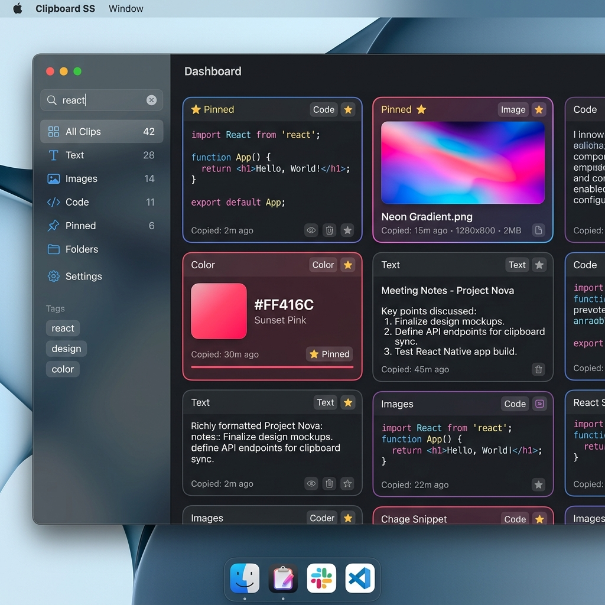
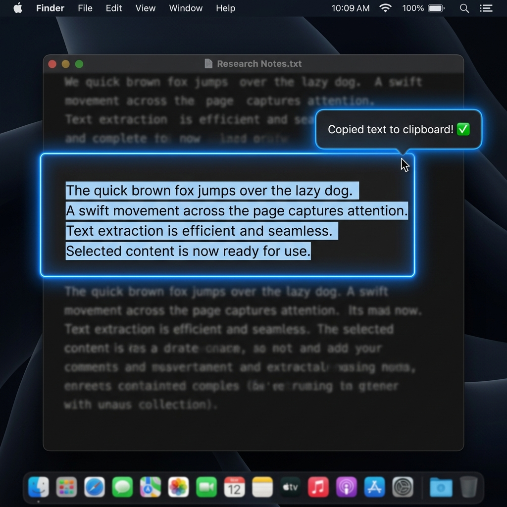
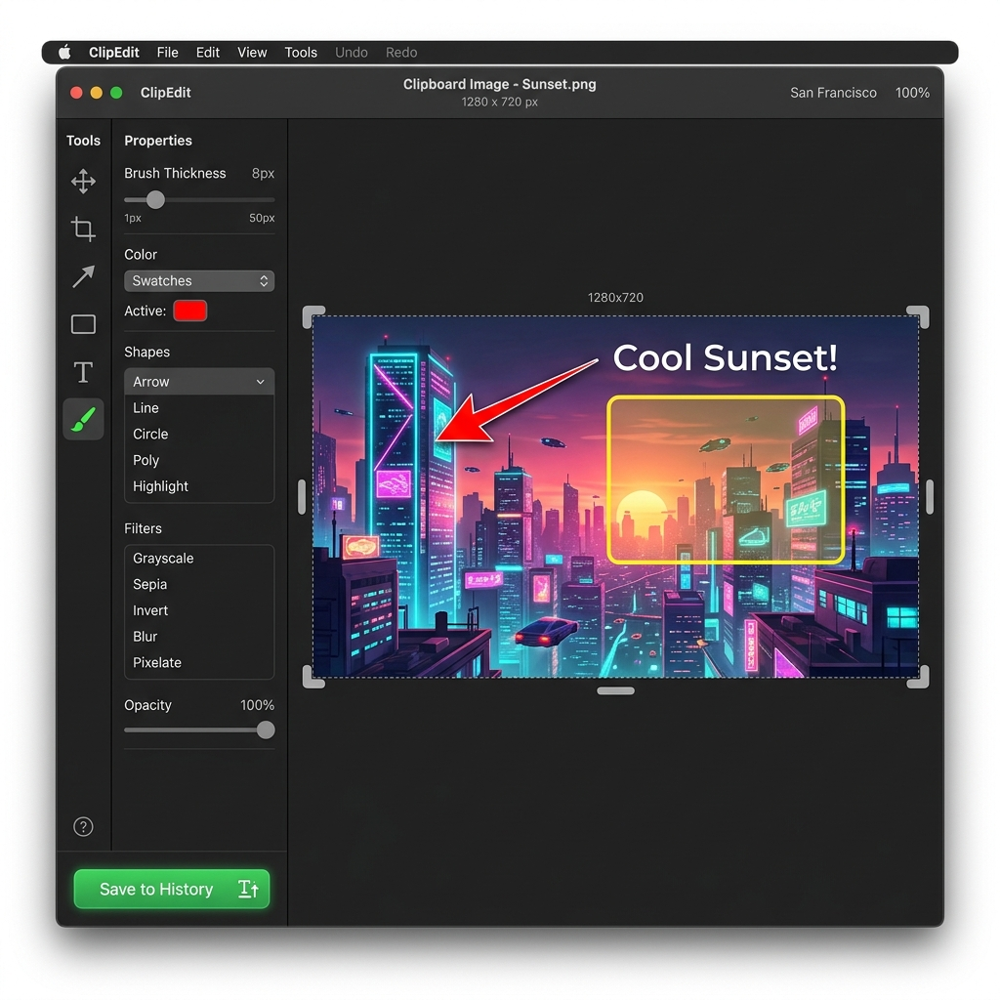

# ClipboardSS

[](https://developer.apple.com/macos/)
[](https://swift.org)
[](LICENSE)
[](https://github.com/sponsors/Leo-120619)
[](https://www.buymeacoffee.com/Leo120619)

A native macOS clipboard history manager that stores text and images, extracts text from images using local optical character recognition (OCR), allows drag-to-OCR screen text selection, and includes an image canvas annotation editor.

---

## Key Features

### 1. Visual Clipboard History
Displays clipboard items as structured visual cards. Text items display formatting and content preview, and copied images show actual image previews.
- **Fuzzy Search & Filters**: Search saved items by text content and filter by type (Text, Images, Pinned).
- **Pinning & Cleanup**: Pin items to save them permanently. Unpinned history items automatically delete after 7 days to preserve local disk space.
- **Copy & Paste Controls**: Single-click an item to update your clipboard, or double-click to paste it directly into the active application.



### 2. Screen Text Selector (Drag-to-OCR)
Extract text from any visible region of your screen. Triggering the shortcut dims the screen and allows you to drag a selection box over any area. The application processes the region locally using Apple's Vision framework and writes the extracted text directly to the system pasteboard.



### 3. Native Image Annotation & Editor
An image canvas editor integrated directly into the clipboard workflow. Edit any image item in your clipboard history or modify a screenshot review immediately after capture.
- **Annotation Tools**: Draw shapes (rectangles, ellipses, straight lines, arrows), freehand paint with adjustable brush thicknesses, and place text layers over the canvas.
- **Filters & Modifiers**: Apply grayscale, sepia, invert, and blur filters. Crop, rotate, and scale images on the fly.
- **Direct Save**: Re-commit modified images back to the clipboard history and copy them to the system pasteboard.



### 4. Screenshot Capture & Review Overlay
Capture custom regions of the screen using a configurable global shortcut. A review window displays instantly, prompting you to hover and click detected OCR text blocks to copy them or open the image editor directly.

---

## Technical Architecture & Privacy

ClipboardSS is designed with a localized, privacy-first architecture:
- **100% Local Processing**: No external network requests are made. All clipboard polling, database storage, and OCR character extraction are executed locally on your machine.
- **Apple Vision Framework**: Utilizes macOS system APIs for OCR, ensuring fast text extraction that operates entirely offline.
- **Swift Package Manager (SPM)**: The codebase is modular, separated into `ClipboardCore` (for cross-cutting file IO, store, and data logic) and `ClipboardSS` (for AppKit, SwiftUI window, and view controllers).

---

## Getting Started

### Prerequisites
- macOS 13.0 or later.
- Xcode 15.0 or later (for compilation).
- Swift Toolchain 5.9 or later.

### Run During Development
To launch the application from terminal during development:
```bash
swift run ClipboardSS
```
*Note: The default keyboard shortcut to activate the main window is `Control + Option + V`.*

### Build a macOS App Bundle
To compile a standalone application bundle and install it to the Applications folder:

1. **Build and test locally**:
   ```bash
   scripts/build_app.sh
   open build/ClipboardSS.app
   ```

2. **Install directly to `/Applications`**:
   ```bash
   scripts/build_app.sh --install
   open /Applications/ClipboardSS.app
   ```

*Note: Set the `CODESIGN_IDENTITY` environment variable before running the script to code sign the bundle with a development certificate. Without it, the script signs the bundle ad-hoc for local use.*

---

## macOS Permissions Required

Because the application interacts with system inputs and screens, macOS requires the following security permissions:
1. **Accessibility**: Allows the application to paste copied items directly into other active applications.
2. **Screen Recording**: Required for the screen capture service to capture screenshots and perform OCR text extraction on screen regions.

If the application does not prompt for permissions, you can manually add `/Applications/ClipboardSS.app` in **System Settings > Privacy & Security > Accessibility / Screen Recording**.

---

## Support the Developer

If you find this tool helpful, consider supporting its maintenance and development:
- **GitHub Sponsors**: [Sponsor Leo-120619](https://github.com/sponsors/Leo-120619)
- **Buy Me a Coffee**: [Buy a coffee for Leo-120619](https://www.buymeacoffee.com/Leo120619)

---

## License
This project is licensed under the MIT License - see the LICENSE file for details.
